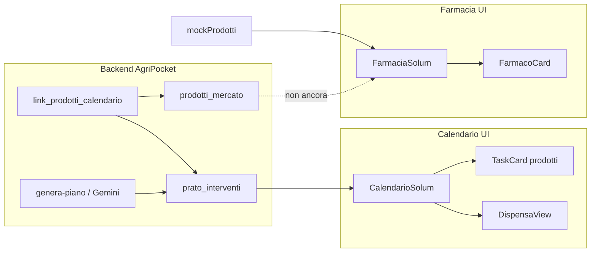

# AgriPocket / Solum — Relazione **Calendario** e **Farmacia intelligente**

**Data:** maggio 2026  
**Repo:** https://github.com/jackjack3737/Agripocket  
**Produzione:**  
- Calendario: https://agripocket-azure.vercel.app/calendario  
- Farmacia: https://agripocket-azure.vercel.app/farmacia  

**Stack:** React 19 · Vite 6 · Tailwind CSS v4 (moduli scoped) · Supabase · API Vercel (`web/`)  
**Deploy:** root Vercel = `web/` · alias `agripocket-azure.vercel.app`

**Commit di riferimento (moduli trattati):**

| Commit | Messaggio |
|--------|-----------|
| `65f9b80` | `fix(calendario): UI Solum minimalista e ombraPct in rinnovo` |
| `e22da5f` | `feat(farmacia): catalogo prescrizionale Smart Pharmacy con filtri e dose su m²` |
| `2e2ff25` | `fix(calendario): mostra prodotti in card, enrich API e match NPK` |
| `1b7c2df` | `feat(matchmaking): motore link_prodotti_calendario con scoring Solum TOP3` |
| `37f997a` | voce Gemini separata + teaser settimana vuota + timeline futuro |

**Documenti correlati (pipeline / revisione IA):**

- Pipeline piano e Gemini: `docs/RELAZIONE_CALENDARIO_GEMINI.md`
- UI calendario per revisore Gemini: `docs/RELAZIONE_UI_CALENDARIO_SOLUM_GEMINI.md`
- Ingest catalogo prodotti: `docs/PRODOTTI_ITALIA_INGEST.md`

---

## Executive summary

AgriPocket espone due superfici complementari per il giardiniere:

1. **Calendario** — *cosa fare e quando* (interventi da `prato_interventi`, voce semplice + scienza su tap, prodotti legati al lavoro).
2. **Farmacia** — *cosa comprare e in che dose* (catalogo filtrabile per bisogno molecolare, dose su m² del profilo).

Il calendario è **collegato al backend reale** (Supabase, generazione piano, matchmaking prodotti, arricchimento automatico). La farmacia è **UI pronta ma dati mock**: stesso linguaggio visivo Solum, stessa logica dose/m², ma non legata ancora a `prodotti_mercato` né al matchmaking del calendario.

Il bug `ombraPct is not defined` (rinnovo/semina) è stato corretto in `raccomandazioneSementi.mjs` (`65f9b80`): la UI calendario non lo referenziava; l’errore nasceva in fase di arricchimento interventi lato server.

---

## 1. Filosofia prodotto (comune)

| Principio | Calendario | Farmacia |
|-----------|------------|----------|
| **Progressive disclosure** | Livello 0: titolo + frase breve + «Segna fatto». Livello 1: «Perché lo facciamo?» (accordion). | Card: badge timing, nome, tag, dose calcolata; dettaglio tecnico in box grigio. |
| **Zero gergo in superficie** | `titolo_semplice_azione`, `messaggio_operativo_breve` (Gemini + fallback). | Obiettivo in linguaggio umano («Resistenza al Caldo»), tag `#AzotoLento` secondari. |
| **Personalizzazione m²** | Dose nei prodotti consigliati (da pipeline). | `calcolaDoseFarmacia(prodotto, profile.superficie_mq)`. |
| **Niente e-commerce aggressivo** | Lista prodotti sotto la card, max 3, senza prezzo. | CTA «Acquista dal Partner» (link esterno), no carrello in-app. |

---

## 2. Calendario Solum

### 2.1 Cosa vede l’utente

| Elemento | Comportamento |
|----------|----------------|
| **Route** | `/calendario` → `CalendarioLavori.jsx` → `CalendarioSolum.jsx` |
| **Nav** | `AppNav`: Calendario · Farmacia · (dashboard/profilo via header) |
| **Header pagina** | Titolo «Il tuo calendario» + sottotitolo; **Aggiorna** in alto a destra (outline, icona 🔄) → `POST /api/genera-piano` |
| **Tab (pillola leggera)** | `bg-gray-100`, attivo `bg-white shadow-sm` |
| **Tab 1 — Questa settimana** | Oggi → +6 giorni; sezione **Da recuperare** (date passate); card con separatori sottili (no box annidati) |
| **Settimana vuota** | 🌿 centrato, «Settimana tranquilla», divisore, teaser **prossimo intervento** (`line-clamp-2`, label `tracking-wider` grigia) |
| **Timeline futuro** | Link «Vedi tutti gli interventi futuri» → bottom-sheet `PianoFuturoPanel` (mese → data + icona + titolo) |
| **Tab 2 — La tua dispensa** | Prodotti da interventi tra **giorno 8 e giorno 30**, raggruppati per mese (lista acquisti predittiva) |
| **Card lavoro** | `TaskCard`: icona, titolo, descrizione, fino a 3 prodotti, accordion scienza, «Segna fatto» testuale |
| **Rimosso dalla pagina** | Vista mensile accordion, filtri tipo/ambito, «Le tue abitudini», `TreatmentCard` inline per ogni riga |

### 2.2 Flusso dati (diagramma)

```
profilo utente + prato_interventi (Supabase)
        │
        ├─► loadInterventi + syncControlliMensili
        │
        ├─► [se piano senza prodotti] POST /api/enrich-prodotti-calendario
        │         └─► enrichProdottiInterventi.mjs + link_prodotti_calendario.mjs
        │
        ├─► filtraInterventiPerCalendario (anno corrente)
        │
        └─► mapInterventoSolum.js
                  ├─ interventoToSolum (treatmentFromIntervento + dettaglio_trattamento JSON)
                  ├─ gruppiSettimanaCorrente
                  ├─ interventiInRitardoSolum
                  ├─ prossimoInterventoSolum (dopo giorno 7)
                  ├─ dispensaPerMese (giorni 8–30)
                  └─ timelineFuturoSolum (oggi → 31/12)
        │
        ▼
CalendarioSolum → WeeklyView | DispensaView | PianoFuturoPanel
        │
        └─► toggleIntervento → setInterventoCompletato (Supabase)
```

**Generazione / aggiornamento piano:** pulsante Aggiorna o auto-avvio se profilo ha `localita` e non esiste piano → `generaPianoAnnuale()` → Gemini + matrice stagionale → `prato_interventi` + link prodotti in pipeline.

### 2.3 Mapping UI ↔ database

Campi preferiti in `dettaglio_trattamento` (o top-level intervento):

| Campo UI | Sorgente (ordine di fallback) |
|----------|-------------------------------|
| `titolo_semplice` | `titolo_semplice_azione` |
| `descrizione_semplice` | `messaggio_operativo_breve` (max ~120 char in mapper) |
| `titolo_tecnico` | `titolo_tecnico` · prima `esigenze_molecolari` |
| `fabbisogno_fisiologico` | `fabbisogno_fisiologico` · elenco esigenze |
| `prodotti` | `prodotti_consigliati` (TOP 3, score ≥ 50) |

Mapper: `web/src/lib/mapInterventoSolum.js` — riusa `treatmentFromIntervento` da `TreatmentCard.jsx` (legacy, ancora fonte parsing JSON).

### 2.4 Motore prodotti sul calendario

File: `web/server/link_prodotti_calendario.mjs`

| Regola | Valore |
|--------|--------|
| Score categoria compatibile | +50 |
| Esigenza molecolare in composizione | +20 ciascuna |
| Parola chiave nel nome prodotto | +10 |
| Macro incompatibili | scarto (0) |
| Soglia minima | **50** |
| Max prodotti / intervento | **3** |

Script batch: `npm run link:prodotti:calendario` (in `web/`).

Arricchimento on-load: se esiste piano stagionale ma interventi trattamento/concime/etc. senza `prodotti_consigliati`, chiamata automatica a `/api/enrich-prodotti-calendario`.

### 2.5 File principali (calendario)

| Ruolo | Path |
|-------|------|
| Pagina | `web/src/pages/CalendarioLavori.jsx` |
| Shell UI | `web/src/components/calendario/CalendarioSolum.jsx` |
| Settimana / teaser | `web/src/components/calendario/solum/WeeklyView.jsx` |
| Card | `web/src/components/calendario/solum/TaskCard.jsx` |
| Scienza | `web/src/components/calendario/solum/ScienzaPanel.jsx` |
| Dispensa | `web/src/components/calendario/solum/DispensaView.jsx` |
| Piano anno | `web/src/components/calendario/solum/PianoFuturoPanel.jsx` |
| Mapper | `web/src/lib/mapInterventoSolum.js` |
| Stili scoped | `web/src/styles/calendario-solum.css` |
| Legacy parsing | `web/src/components/calendario/TreatmentCard.jsx` |
| API enrich | `web/api/enrich-prodotti-calendario.js` |
| API piano | `web/api/genera-piano.js` |

### 2.6 Stato e limiti noti (calendario)

| Tema | Stato |
|------|--------|
| UI minimalista (HIG/Vercel) | ✅ Deploy `65f9b80` |
| Prodotti in card | ✅ Se presenti in DB; enrich al caricamento |
| Piani vecchi senza campi Gemini nuovi | ⚠️ Serve «Aggiorna piano» per rigenerare copy |
| Dispensa senza prezzi/link shop | ⚠️ Solo nomi e mese — utile come promemoria, non come carrello |
| `TreatmentCard` vs `TaskCard` | Duplicazione parsing; dashboard può ancora usare TreatmentCard |
| Accessibilità tab | `role="tablist"` presente; focus ring da rifinire |

---

## 3. Farmacia intelligente

### 3.1 Cosa vede l’utente

| Elemento | Comportamento |
|----------|----------------|
| **Route** | `/farmacia` → `Farmacia.jsx` → `FarmaciaSolum.jsx` |
| **Titolo** | «Farmacia intelligente» — dose su `profile.superficie_mq` (default 150 m²) |
| **Layout desktop** | Sidebar 25% filtri · griglia 75% card (2 colonne da `md`) |
| **Layout mobile** | Pulsante «Filtra per bisogno» → bottom-sheet filtri (`lucide-react`) |
| **Filtri** | Azione (antistress, radicazione, funghi, rinverdimento) + molecola (Trichoderma, ferro, umettanti, azoto lento) — match regex su testo prodotto |
| **Card prodotto** | `FarmacoCard`: badge timing (ora / tra 1 mese), immagine, tag tecnici, box dose, link partner |
| **Dose** | `calcolaDoseFarmacia`: `dose_mq × m²` → grammi/kg e confezioni da `formato_vendita` |

### 3.2 Flusso dati (attuale vs target)

**Oggi (mock):**

```
MOCK_PRODOTTI_FARMACIA (mockProdotti.js)
        │
        ├─► prodottoPassaFiltri(azioni, molecole)
        └─► FarmacoCard + calcolaDoseFarmacia(userMq)
```

**Target (non implementato):**

```
prodotti_mercato (Supabase) + profilo + piano calendario
        │
        ├─► API GET /api/farmacia-catalogo (?)
        │     · prodotti con score / macro allineati a bisogni attuali
        │     · timing_tag da prossimo intervento (8–30 gg = «ora»)
        │
        ├─► link_prodotti_calendario (stesso motore del calendario)
        └─► FarmaciaSolum(prodotti={reali}, userMq={profilo})
```

### 3.3 Modello dati mock (contratto UI)

Ogni prodotto mock espone:

| Campo | Uso |
|-------|-----|
| `nome_commerciale`, `marca`, `immagine` | Card |
| `tag_tecnici[]` | Chip verdi |
| `obiettivo`, `molecola_chiave` | Filtri + sottotitolo dose |
| `dose_mq`, `unita_misura`, `formato_vendita` | Calcolo confezioni |
| `timing_tag` | `ora` \| `futuro` → badge verde/giallo |
| `link_partner` | CTA esterna |

### 3.4 File principali (farmacia)

| Ruolo | Path |
|-------|------|
| Pagina | `web/src/pages/Farmacia.jsx` |
| Shell | `web/src/components/farmacia/FarmaciaSolum.jsx` |
| Card | `web/src/components/farmacia/FarmacoCard.jsx` |
| Filtri | `web/src/components/farmacia/FiltriFarmacia.jsx` |
| Dose | `web/src/components/farmacia/calcolaDoseFarmacia.js` |
| Mock | `web/src/components/farmacia/mockProdotti.js` |
| Stili | `web/src/styles/farmacia-solum.css` |

### 3.5 Stato e limiti noti (farmacia)

| Tema | Stato |
|------|--------|
| UI responsive + filtri | ✅ Produzione `e22da5f` |
| Catalogo reale `prodotti_mercato` | ❌ Non collegato |
| Allineamento al calendario dell’utente | ❌ Nessun filtro «per i tuoi prossimi lavori» |
| Immagini / link partner | Placeholder e URL fittizi |
| Nav da calendario → farmacia con contesto | ❌ Nessun deep-link (es. «compra per questo lavoro») |

---

## 4. Relazione Calendario ↔ Farmacia



| Punto di contatto | Calendario | Farmacia |
|-------------------|------------|----------|
| **Stessa tabella prodotti** | `prodotti_consigliati` in intervento | Dovrebbe leggere `prodotti_mercato` |
| **Stesso motore match** | Sì, in pipeline + enrich | Da riusare per ranking catalogo |
| **Stessi m²** | Dose in dettaglio trattamento | `profile.superficie_mq` |
| **Dispensa vs catalogo** | Dispensa = subset temporale 8–30 gg | Catalogo = esplorazione per bisogno |
| **UX coerente** | Tailwind minimal, max-width `lg` calendario | Tailwind card grid, verde Solum |

**Proposta integrazione (roadmap):**

1. Endpoint catalogo filtrato per `user_id` (interventi prossimi 60 gg → macro/molecole uniche → TOP prodotti).
2. Tab farmacia «Consigliati per te» (default) vs «Esplora tutto».
3. Da `TaskCard`, link «Vedi in farmacia» con query `?molecola=Potassio` o `intervento_id=`.
4. Allineare `calcolaDoseFarmacia` con dose già mostrata nel calendario (una sola funzione condivisa).

---

## 5. API e operazioni

| Endpoint / script | Scopo |
|-------------------|--------|
| `POST /api/genera-piano` | Crea/aggiorna piano annuale |
| `POST /api/enrich-prodotti-calendario` | Collega prodotti a interventi esistenti |
| `npm run link:prodotti:calendario` | Batch match su DB |
| *(assente)* `/api/farmacia` | Catalogo farmacia reale |

---

## 6. Scenari utente (accettazione)

### Calendario

| Scenario | Atteso |
|----------|--------|
| Settimana con 2 lavori | Tab settimana: «Oggi» / «Domani» + card + prodotti se linkati |
| Settimana vuota, piano futuro | Teaser prossimo intervento + link timeline |
| Solo ritardi | Sezione «Da recuperare» sopra i giorni |
| Piano senza prodotti | Enrich automatico o messaggio dopo Aggiorna piano |
| Nessuna località | Messaggio link onboarding; Aggiorna disabilitato |

### Farmacia

| Scenario | Atteso |
|----------|--------|
| Primo accesso | 2 card mock, filtri funzionanti |
| Filtro «Lotta ai funghi» | Solo prodotti il cui testo matcha regex funghi |
| m² = 200 | Dose ricalcolata su card |
| Mobile | Sheet filtri + griglia 1 colonna |

---

## 7. Roadmap sintetica

### Sprint A — Must (collegare i due mondi)

- [ ] API farmacia da `prodotti_mercato` (+ paginazione)
- [ ] Sezione «Per i tuoi prossimi lavori» derivata da `prato_interventi`
- [ ] Deep-link calendario → farmacia
- [ ] Funzione dose unificata server/client

### Sprint B — Should (calendario)

- [ ] Rigenerazione piano guidata (banner se campi Gemini mancanti)
- [ ] Dispensa: link acquisto opzionale se `link_partner` in prodotto
- [ ] Convergere `TreatmentCard` parsing in modulo `lib/` senza componente UI

### Sprint C — Nice (farmacia + polish)

- [ ] Immagini reali catalogo ingest
- [ ] Prezzo indicativo / disponibilità partner (se contratto dati)
- [ ] Confronto side-by-side 2 prodotti TOP3 per stesso intervento
- [ ] Analytics: tap CTA partner, completamento intervento

---

## 8. Checklist deploy / QA

| Verifica | URL / azione |
|----------|----------------|
| Calendario carica senza errori console | `/calendario` |
| Tab pillola e refresh header | UI post-`65f9b80` |
| Settimana vuota + teaser | Utente senza lavori in 7 gg |
| Prodotti sotto card | Dopo enrich o piano nuovo |
| Farmacia mobile filtri | `/farmacia` viewport &lt; 1024px |
| CTA partner apre tab esterna | Mock link |
| Genera piano | Profilo con località, attendere 1–2 min |

---

## 9. Glossario rapido

| Termine | Significato |
|---------|-------------|
| **Solum** | Layer UX/copy sopra motore agronomico + IA |
| **Progressive disclosure** | Informazione minima visibile; dettaglio su richiesta |
| **Dispensa** | Lista acquisti preventiva (giorni 8–30), non magazzino utente |
| **Matchmaking** | `link_prodotti_calendario.mjs` — scoring prodotto ↔ intervento |
| **Enrich** | Backfill `prodotti_consigliati` su piani già esistenti |

---

*Relazione redatta per team prodotto, revisori UX e integrazione catalogo. Per analisi solo pipeline Gemini del calendario, usare `RELAZIONE_CALENDARIO_GEMINI.md`; per checklist revisore UI calendario, `RELAZIONE_UI_CALENDARIO_SOLUM_GEMINI.md`.*
